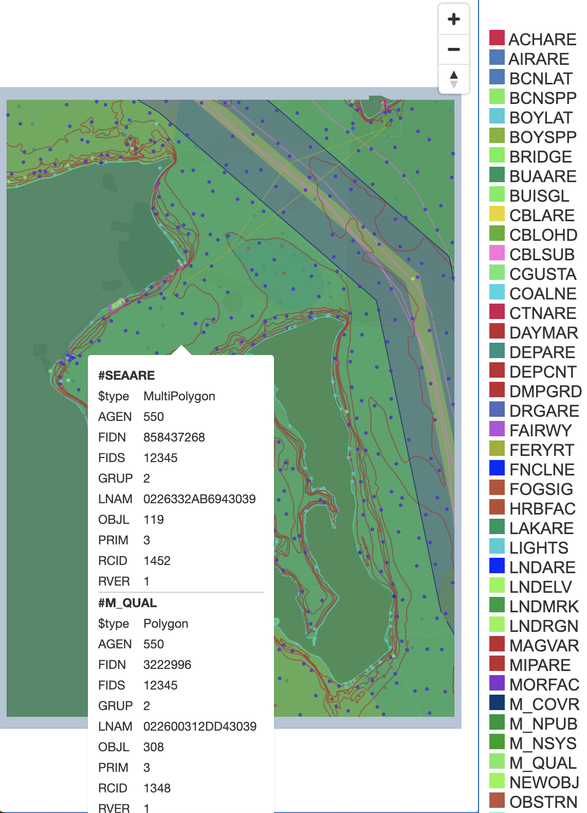

# S57 Chart to GeoJson & Mapbox Vector Tile (MVT) Renderer

The goal of this project is to render geojson and json meta data from S57 nautical chart files suitable for input to 
tippecanoe which transforms the data into MVT / MBTiles.

We will then serve the data with [tileserver-gl](https://github.com/maptiler/tileserver-gl) and work on styling the chart
with [maputnik](https://github.com/maputnik/editor/wiki).

Note: This project is still a WIP. I plan additionally creating an open source S57 theme based on 
[OpenCPN data](https://raw.githubusercontent.com/OpenCPN/OpenCPN/master/data/s57data/chartsymbols.xml). The theme will
be published in a TDB Github repo.

### Example

```shell script
docker build -t s57t .
docker run -v ${HOME}/Charts/:/charts s57t s57tiler -i /charts/ENC_ROOT/US5WA28M/US5WA28M.000 -o /charts/mvt
docker run --rm -v ${HOME}/Charts/mvt:/data -p 8080:80 maptiler/tileserver-gl
docker run -it --rm -p 8888:8888 maputnik/editor
```

### Screenshots

Un-styled render of Puget Sound chart [US5WA28M](https://charts.noaa.gov/ENCs/ENCsIndv.shtml) rendered with [tileserver-gl](https://github.com/maptiler/tileserver-gl)


You could use ogr2ogr to generate the geojson. However, we need to extract the z coordinate out of the SOUNDG layer.
```shell script
ogrinfo $HOME/Charts/ENC_ROOT/US3WA01M/US3WA01M.000 | cut -f2 -d ' '
ogr2ogr -t_srs 'EPSG:4326' -f GeoJSON $HOME/source/madrona/s57_tiler/geojson_out/ADMARE.json $HOME/Charts/ENC_ROOT/US3WA01M/US3WA01M.000 ADMARE
```

###  Dev Setup

MacOS
```shell script
brew install gdal tippecanoe
```

Linux
```shell script
apt install -y libgdal-dev
git clone https://github.com/mapbox/tippecanoe.git && \
    cd tippecanoe && \
    make
sudo cp /tippecanoe/tippecanoe /usr/local/bin/tippecanoe
sudo cp /tippecanoe/tile-join /usr/local/bin/tile-join
sudo cp /tippecanoe/tippecanoe-decode /usr/local/bin/tippecanoe-decode
sudo cp /tippecanoe/tippecanoe-enumerate /usr/local/bin/tippecanoe-enumerate
sudo cp /tippecanoe/tippecanoe-json-tool /usr/local/bin/tippecanoe-json-tool
```

[rustup](https://rustup.rs/)

