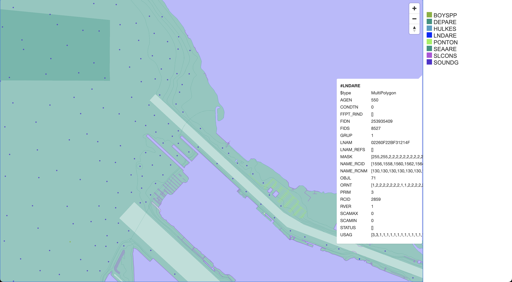

# S57 Chart to GeoJson & Mapbox Vector Tile (MVT) Renderer

The goal of this project is to render geojson and json meta data from S57 nautical chart files suitable for input to 
[tippecanoe](https://github.com/mapbox/tippecanoe) which transforms the data into [MVT](https://docs.mapbox.com/vector-tiles/specification/) / MBTiles.

We will then serve the data with [tileserver-gl](https://github.com/maptiler/tileserver-gl) and work on styling the chart
with [maputnik](https://github.com/maputnik/editor/wiki).

Note: This project is still very much a *WORK IN PROGRESS*.

### Example

```shell script
cargo run -- mbtiles -i $(pwd)/data/charts/US5WA22M/US5WA22M.000 -o $(pwd)/data -n LNDARE,DEPARE,SEAARE,SLCONS,PONTON,HULKES,SOUNDG,BOYSPP
cargo run -- config -o $(pwd)/data -s localhost:8080,127.0.0.1:8080
cargo run -- style -o $(pwd)/data/styles -s 127.0.0.1:8080
docker run --rm -v $(pwd)/data:/data -p 8080:80 maptiler/tileserver-gl

#OR
docker build -t s57t .
docker run -v $(pwd)/data:/data s57t s57tiler mbtiles -i /data/charts/US5WA22M/US5WA22M.000 -o /data -n LNDARE,DEPARE,SEAARE,SLCONS,PONTON,HULKES,SOUNDG,BOYSPP

# Serve up the rendered marine chart / map
docker run --rm -v $(pwd)/data:/data -p 8080:80 maptiler/tileserver-gl:v3.1.1

# Optionally fire up maputnik to work on styling
docker run -it --rm -p 8888:8888 maputnik/editor
```

### Screenshots
[US5WA22M](https://charts.noaa.gov/ENCs/ENCsIndv.shtml) rendered with [tileserver-gl](https://github.com/maptiler/tileserver-gl)

You can find a live demo here: [https://s57dev.mxmariner.com/styles/day_bright_style/#14/47.27888/-122.41757](https://s57dev.mxmariner.com/styles/day_bright_style/#14/47.27888/-122.41757) 

|Un-styled|Styled (WIP)|
|---------|------------|
|||
 

###  Dev Setup

In order to run this locally you'll need system [gdal](https://gdal.org/) installed as well as 
[tippecanoe](https://github.com/mapbox/tippecanoe). And of course since this is rust you'll need to follow the 
[rustup](https://rustup.rs/) guide. 

MacOS
```shell script
brew install gdal tippecanoe
```

Linux
```shell script
apt install -y libgdal-dev
git clone https://github.com/mapbox/tippecanoe.git && \
    cd tippecanoe && \
    make
sudo cp /tippecanoe/tippecanoe /usr/local/bin/tippecanoe
sudo cp /tippecanoe/tile-join /usr/local/bin/tile-join
sudo cp /tippecanoe/tippecanoe-decode /usr/local/bin/tippecanoe-decode
sudo cp /tippecanoe/tippecanoe-enumerate /usr/local/bin/tippecanoe-enumerate
sudo cp /tippecanoe/tippecanoe-json-tool /usr/local/bin/tippecanoe-json-tool
```